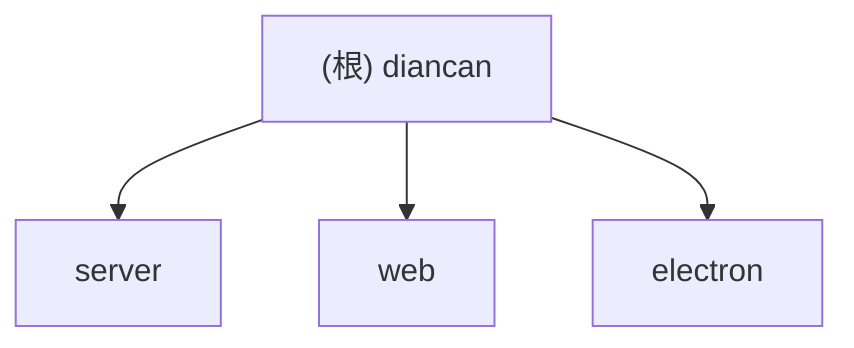

# 点餐系统 (Restaurant Ordering System)

## 项目愿景

面向中小型餐厅的一体化点餐管理系统，支持桌位管理、菜品点餐、上菜队列、结账收银、营业统计与历史查询。提供 PC 端与移动端自适应界面，可通过 Electron 打包为 Windows 桌面应用。

## 架构总览

- 前后端分离的单体应用，三层结构：Electron 壳 + Vue3 前端 + Express 后端
- 后端：Express 4 + TypeScript，模块化 Router/Service/Repo 分层，SQLite (better-sqlite3) 持久化
- 前端：Vue 3 + Vite 6 + Pinia + Naive UI + TailwindCSS 3 + ECharts，支持 PC/Mobile 双路由
- 桌面端：Electron 33，fork 子进程启动后端服务，加载前端页面
- 实时通信：SSE (Server-Sent Events) 推送订单/上菜/结账等事件
- 数据库迁移：自研轻量 SQL 文件迁移机制 (0001~0008)

## 模块结构图



## 模块索引

| 模块 | 路径 | 语言 | 职责 |
|------|------|------|------|
| server | `server/` | TypeScript (Node.js) | Express REST API 后端，SQLite 数据层，SSE 推送 |
| web | `web/` | TypeScript (Vue 3) | 前端 SPA，PC/Mobile 双布局，点餐/上菜/结账/统计 UI |
| electron | `electron/` | TypeScript | Electron 桌面壳，fork 后端进程，系统托盘，IPC 对话框 |

## 运行与开发

### 环境要求

- Node.js >= 18 (推荐 20+)
- npm

### 安装依赖

```bash
npm install
cd server && npm install
cd ../web && npm install
```

### 开发模式

```bash
npm run dev          # 同时启动 server (tsx watch, :3000) 和 web (vite, :5173)
npm run dev:server   # 仅启动后端
npm run dev:web      # 仅启动前端
```

前端开发服务器通过 Vite proxy 将 `/api` 请求转发到 `http://localhost:3000`。

### 构建

```bash
npm run build:server   # tsc 编译 + 复制 migrations
npm run build:web      # vue-tsc + vite build，输出到 web-dist/
npm run dist           # 完整 Electron 打包 (Windows)
```

### 关键端口与路径

- 后端 API：`http://0.0.0.0:3000/api/v1/`
- 前端开发：`http://localhost:5173`
- 数据库默认路径：`./data/diancan.db` (开发) 或 `%APPDATA%/diancan/diancan.db` (Electron)
- 配置文件：`./data/config.json` 或 `%APPDATA%/diancan/config.json`

### 环境变量

| 变量 | 说明 | 默认值 |
|------|------|--------|
| `PORT` | 后端监听端口 | `3000` |
| `DB_PATH` | 数据库文件路径 | `./data/diancan.db` |
| `CORS_ORIGIN` | CORS 允许源 | `*` |
| `ADMIN_TOKEN` | 管理员操作令牌 (可选) | 无 (回退本机 IP 校验) |

## 测试策略

当前项目未配置自动化测试框架。建议后续引入 Vitest (前端) 和 Jest/Vitest (后端) 进行单元与集成测试。

## 编码规范

- TypeScript strict 模式
- 后端模块化：每个业务域 `{domain}.router.ts` / `{domain}.service.ts` / `{domain}.repo.ts`
- 统一 API 响应格式：`{ ok, data?, error?, meta: { requestId, ts } }`
- 金额使用分 (cents) 为单位，避免浮点精度问题
- 前端状态管理：Pinia stores，持久化插件
- CSS：TailwindCSS 工具类 + CSS 变量主题系统 (支持亮/暗色)
- 路由：PC (`/`) 与 Mobile (`/m`) 双路由体系，自动检测屏幕宽度跳转

## AI 使用指引

- 修改后端 API 时，同步更新 `server/src/shared/types.ts` 和 `web/src/types/index.ts` 中的类型定义
- 新增业务模块时，在 `server/src/modules/` 下创建子目录，包含 router/service/repo 三文件，并在 `app.ts` 中注册路由
- 数据库变更通过新增 SQL 迁移文件 (`server/src/db/migrations/NNNN_xxx.sql`)，编号递增
- SSE 事件类型定义在 `server/src/modules/sse/sse.hub.ts`，新增事件需同步更新 `SseEventName` 类型
- 前端新增页面需在 `web/src/router/index.ts` 注册路由，PC 和 Mobile 路由分开定义
- 前端 API 调用统一使用 `web/src/api/client.ts` 中的 `get/post/patch/del` 方法

## 变更记录 (Changelog)

| 时间 | 操作 | 说明 |
|------|------|------|
| 2026-02-20 15:10:51 UTC | 初始化 | 首次生成项目文档，覆盖全部 3 个模块 |
